# Architecture

```mermaid
graph TB
    subgraph "Client Side" 
    WS[WebSocket Client Browser/App] 
    PAGE[Web Page Django Template] 
    end
subgraph "AWS Infrastructure"
    APIGW[AWS API Gateway<br/>WebSocket API]
    subgraph "Routes"
        CONN[$connect Route]
        DISC[$disconnect Route]
        DEF[$default Route]
        CUST[Custom Routes<br/>e.g., 'action:chat']
    end
end

subgraph "Django Application"
    subgraph "URL Routing"
        URL[urls.py<br/>ws/&lt;slug:route&gt;]
        TOKEN_URL[urls.py<br/>api/ws-token/]
    end
    
    subgraph "Token Generation (CSRF Protection)"
        TOKEN_VIEW[WebSocketTokenView<br/>CSRF Protected]
        TOKEN_GEN[Generate Token<br/>60s TTL, Single-use]
    end

    subgraph "WebSocketView Class"
        DISPATCH[dispatch Method<br/>Route Dispatcher]
        SETUP[setup Method<br/>Parse JSON Body]
    
        subgraph "Security Checks (Multi-Layer)"
            RL[Rate Limiting<br/>IP + User Based]
            HDR[Header Validation]
            APIGW_CHK[API Gateway Check]
            TOKEN_CHK[Token Validation<br/>IF USE_WS_TOKEN=True]
            CONN_ID[Connection ID<br/>Validation]
            UA[User Agent Check]
            PERM[Permission Check<br/>ALLOWED_HANDLERS]
            CHAN_VAL[Channel Name<br/>Validation]
        end
    
        subgraph "Handler Methods"
            CONNECT[connect Handler<br/>Create Session]
            DISCONNECT[disconnect Handler<br/>Mark Disconnected]
            DEFAULT[default Handler<br/>User Implementation]
            CUSTOM[Custom Handlers<br/>Based on action/handler key]
        end
    end

    subgraph "Models & Database"
        APIGW_MODEL[(ApiGateway Model<br/>Gateway Config)]
        WSS_MODEL[(WebSocketSession Model<br/>Connection Tracking)]
        ROUTE_MODEL[(ApiGatewayAdditionalRoute<br/>Custom Routes)]
        TOKEN_MODEL[(WebSocketToken Model<br/>CSRF Tokens)]
        RATE_MODEL[(ConnectionRateLimit Model<br/>Rate Tracking)]
    end

    subgraph "Admin & Management"
        ADMIN[Django Admin<br/>+ Audit Logging]
        CMD[Management Commands<br/>createApiGateway<br/>createCustomDomain<br/>clearWebSocketSessions<br/>cleanupWebSocketTokens]
    end
end

subgraph "Messaging Flow"
    subgraph "Send Messages"
        SEND_UNI[Unicast<br/>websocket_session.send_message]
        SEND_MULTI[Multicast<br/>QuerySet.send_message<br/>Channel-based]
        SEND_BROAD[Broadcast<br/>All connected sessions]
    end

    BOTO3[Boto3 Client<br/>apigatewaymanagementapi]
end

%% Token Generation Flow (Version 3.0+)
PAGE -->|1a. Request Token<br/>POST + CSRF| TOKEN_URL
TOKEN_URL --> TOKEN_VIEW
TOKEN_VIEW -->|Check Auth| TOKEN_VIEW
TOKEN_VIEW -->|Check Rate Limit| TOKEN_MODEL
TOKEN_MODEL -->|Not Exceeded| TOKEN_GEN
TOKEN_GEN -->|Create Token| TOKEN_MODEL
TOKEN_MODEL -->|Return Token<br/>expires_in: 60| PAGE

%% Connection Flow (With Token)
PAGE -->|1b. WebSocket Connect<br/>?ws_token=xxx&channel=yyy| WS
WS -->|2. WS Connect + Token| APIGW
APIGW -->|3. HTTP POST| CONN
CONN -->|4. Route: 'connect'| URL
URL --> DISPATCH
DISPATCH --> SETUP
SETUP --> RL
RL -->|Check IP/User Limits| RATE_MODEL
RATE_MODEL -->|Within Limits| HDR
HDR --> APIGW_CHK
APIGW_CHK -->|Gateway Validated| TOKEN_CHK
TOKEN_CHK -->|IF USE_WS_TOKEN| TOKEN_MODEL
TOKEN_MODEL -->|Validate & Consume<br/>Single-use| CONN_ID
CONN_ID -->|ID Valid| CHAN_VAL
CHAN_VAL -->|Validated| CONNECT
CONNECT -->|Create Record| WSS_MODEL
CONNECT -->|Link User & Channel| WSS_MODEL
CONNECT -->|Record Attempt| RATE_MODEL
WSS_MODEL -->|200 OK| APIGW
APIGW -->|Connection Established| WS

%% Message Flow
WS -->|5. Send Message<br/>action: 'chat'| APIGW
APIGW -->|6. Route via<br/>route_selection_expression| DEF
DEF -->|7. HTTP POST| URL
URL --> DISPATCH
DISPATCH --> SETUP
SETUP --> UA
UA --> PERM
PERM -->|Check ALLOWED_HANDLERS| PERM
PERM -->|Load Session| WSS_MODEL
PERM -->|Check Permissions| CUSTOM
CUSTOM -->|Process Logic| CUSTOM

%% Disconnect Flow
WS -->|8. Disconnect| APIGW
APIGW -->|9. HTTP POST| DISC
DISC --> URL
URL --> DISPATCH
DISPATCH --> DISCONNECT
DISCONNECT -->|Mark connected=False| WSS_MODEL

%% Server to Client
CUSTOM -.->|Send Response| SEND_UNI
CUSTOM -.->|Broadcast to Channel| SEND_MULTI
SEND_UNI --> BOTO3
SEND_MULTI --> BOTO3
BOTO3 -->|post_to_connection<br/>Max 128KB| APIGW
APIGW -->|Push Message| WS

%% Admin/Management
ADMIN -->|Configure & Deploy<br/>+ Audit Logs| APIGW_MODEL
ADMIN -->|Create Gateway| APIGW
CMD -->|Setup Infrastructure| APIGW_MODEL
CMD -->|Cleanup Tokens<br/>Every 5 min| TOKEN_MODEL
CMD -->|Cleanup Rate Limits| RATE_MODEL
APIGW_MODEL -.->|Reference| WSS_MODEL
ROUTE_MODEL -.->|Extends| APIGW_MODEL

%% Styling
classDef clientClass fill:#e1f5ff,stroke:#0366d6
classDef awsClass fill:#ff9900,stroke:#cc7a00
classDef djangoClass fill:#0c4b33,stroke:#092e20,color:#fff
classDef modelClass fill:#ffd700,stroke:#b8860b
classDef messageClass fill:#90ee90,stroke:#228b22
classDef securityClass fill:#ff6b6b,stroke:#c92a2a,color:#fff

class WS,PAGE clientClass
class APIGW,CONN,DISC,DEF,CUST awsClass
class URL,TOKEN_URL,DISPATCH,SETUP,CONNECT,DISCONNECT,DEFAULT,CUSTOM,ADMIN,CMD djangoClass
class APIGW_MODEL,WSS_MODEL,ROUTE_MODEL,TOKEN_MODEL,RATE_MODEL modelClass
class SEND_UNI,SEND_MULTI,SEND_BROAD,BOTO3 messageClass
class RL,HDR,APIGW_CHK,TOKEN_CHK,CONN_ID,UA,PERM,CHAN_VAL,TOKEN_VIEW,TOKEN_GEN securityClass
```

The architecture documentation for this project is maintained in the Read the Docs documentation.

Please see:

[Architecture - Django-AWS-API-Gateway-WebSockets documentation](https://django-aws-api-gateway-websockets.readthedocs.io/en/latest/architecture.html)

The source file for the published architecture documentation is:
```text
docs/architecture.rst
```

# Architecture Diagram


