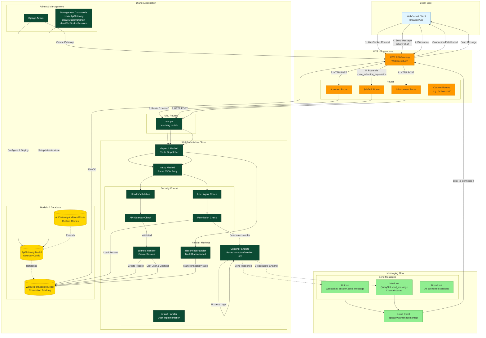

# Architecture

## Architecture Overview
This Django package enables WebSocket functionality using AWS API Gateway with the following key components:
### **Core Flow**
1. **Connection Phase ($connect)**
    - Client initiates WebSocket connection to AWS API Gateway
    - API Gateway sends HTTP POST to Django view with route='connect'
    - `WebSocketView.connect()` validates headers, user authentication, and security
    - Creates record linking connection_id, user, and optional channel `WebSocketSession`
    - Returns 200 OK to establish connection

2. **Message Handling ($default or custom routes)**
    - Client sends JSON message with "action" or "handler" key
    - API Gateway routes based on (default: ) `route_selection_expression``$request.body.action`
    - Django `dispatch()` method selects appropriate handler method dynamically
    - Loads WebSocketSession, validates permissions, and processes request
    - Handler can send responses via `websocket_session.send_message()` using Boto3

3. **Disconnection ($disconnect)**
    - Client disconnects or connection times out
    - API Gateway notifies Django
    - `WebSocketView.disconnect()` marks session as `connected=False` in database

### **Key Features**
- **Session Management**: Tracks all WebSocket connections with user association
- **Channel Support**: Groups connections for multicast messaging
- **Permission Control**: Django permissions integration (, ) `permissions_required``all_permissions_required`
- **Message Patterns**:
    - **Unicast**: Send to specific connection via `websocket_session.send_message()`
    - **Multicast**: Send to channel via `WebSocketSession.objects.filter(channel_name='...').send_message()`
    - **Broadcast**: Send to all connected sessions

- **Class-Based Views**: Standard Django CBV pattern for WebSocket handling
- **Admin Integration**: Manage API Gateways, routes, and sessions via Django Admin
- **Management Commands**: CLI tools for infrastructure setup and maintenance