# Architecture

```mermaid
graph TB
    subgraph "Client Side" 
    WS[WebSocket Client Browser/App] 
    PAGE[Web Page Django Template] 
    end
subgraph "AWS Infrastructure"
    APIGW[AWS API Gateway<br/>WebSocket API]
    subgraph "Routes"
        CONN[$connect Route]
        DISC[$disconnect Route]
        DEF[$default Route]
        CUST[Custom Routes<br/>e.g., 'action:chat']
    end
end

subgraph "Django Application"
    subgraph "URL Routing"
        URL[urls.py<br/>ws/&lt;slug:route&gt;]
        TOKEN_URL[urls.py<br/>api/ws-token/]
    end
    
    subgraph "Token Generation (CSRF Protection)"
        TOKEN_VIEW[WebSocketTokenView<br/>CSRF Protected]
        TOKEN_GEN[Generate Token<br/>60s TTL, Single-use]
    end

    subgraph "WebSocketView Class"
        DISPATCH[dispatch Method<br/>Route Dispatcher]
        SETUP[setup Method<br/>Parse JSON Body]
    
        subgraph "Security Checks (Multi-Layer)"
            RL[Rate Limiting<br/>IP + User Based]
            HDR[Header Validation]
            APIGW_CHK[API Gateway Check]
            TOKEN_CHK[Token Validation<br/>IF USE_WS_TOKEN=True]
            CONN_ID[Connection ID<br/>Validation]
            UA[User Agent Check]
            PERM[Permission Check<br/>ALLOWED_HANDLERS]
            CHAN_VAL[Channel Name<br/>Validation]
        end
    
        subgraph "Handler Methods"
            CONNECT[connect Handler<br/>Create Session]
            DISCONNECT[disconnect Handler<br/>Mark Disconnected]
            DEFAULT[default Handler<br/>User Implementation]
            CUSTOM[Custom Handlers<br/>Based on action/handler key]
        end
    end

    subgraph "Models & Database"
        APIGW_MODEL[(ApiGateway Model<br/>Gateway Config)]
        WSS_MODEL[(WebSocketSession Model<br/>Connection Tracking)]
        ROUTE_MODEL[(ApiGatewayAdditionalRoute<br/>Custom Routes)]
        TOKEN_MODEL[(WebSocketToken Model<br/>CSRF Tokens)]
        RATE_MODEL[(ConnectionRateLimit Model<br/>Rate Tracking)]
    end

    subgraph "Admin & Management"
        ADMIN[Django Admin<br/>+ Audit Logging]
        CMD[Management Commands<br/>createApiGateway<br/>createCustomDomain<br/>clearWebSocketSessions<br/>cleanupWebSocketTokens]
    end
end

subgraph "Messaging Flow"
    subgraph "Send Messages"
        SEND_UNI[Unicast<br/>websocket_session.send_message]
        SEND_MULTI[Multicast<br/>QuerySet.send_message<br/>Channel-based]
        SEND_BROAD[Broadcast<br/>All connected sessions]
    end

    BOTO3[Boto3 Client<br/>apigatewaymanagementapi]
end

%% Token Generation Flow (Version 3.0+)
PAGE -->|1a. Request Token<br/>POST + CSRF| TOKEN_URL
TOKEN_URL --> TOKEN_VIEW
TOKEN_VIEW -->|Check Auth| TOKEN_VIEW
TOKEN_VIEW -->|Check Rate Limit| TOKEN_MODEL
TOKEN_MODEL -->|Not Exceeded| TOKEN_GEN
TOKEN_GEN -->|Create Token| TOKEN_MODEL
TOKEN_MODEL -->|Return Token<br/>expires_in: 60| PAGE

%% Connection Flow (With Token)
PAGE -->|1b. WebSocket Connect<br/>?ws_token=xxx&channel=yyy| WS
WS -->|2. WS Connect + Token| APIGW
APIGW -->|3. HTTP POST| CONN
CONN -->|4. Route: 'connect'| URL
URL --> DISPATCH
DISPATCH --> SETUP
SETUP --> RL
RL -->|Check IP/User Limits| RATE_MODEL
RATE_MODEL -->|Within Limits| HDR
HDR --> APIGW_CHK
APIGW_CHK -->|Gateway Validated| TOKEN_CHK
TOKEN_CHK -->|IF USE_WS_TOKEN| TOKEN_MODEL
TOKEN_MODEL -->|Validate & Consume<br/>Single-use| CONN_ID
CONN_ID -->|ID Valid| CHAN_VAL
CHAN_VAL -->|Validated| CONNECT
CONNECT -->|Create Record| WSS_MODEL
CONNECT -->|Link User & Channel| WSS_MODEL
CONNECT -->|Record Attempt| RATE_MODEL
WSS_MODEL -->|200 OK| APIGW
APIGW -->|Connection Established| WS

%% Message Flow
WS -->|5. Send Message<br/>action: 'chat'| APIGW
APIGW -->|6. Route via<br/>route_selection_expression| DEF
DEF -->|7. HTTP POST| URL
URL --> DISPATCH
DISPATCH --> SETUP
SETUP --> UA
UA --> PERM
PERM -->|Check ALLOWED_HANDLERS| PERM
PERM -->|Load Session| WSS_MODEL
PERM -->|Check Permissions| CUSTOM
CUSTOM -->|Process Logic| CUSTOM

%% Disconnect Flow
WS -->|8. Disconnect| APIGW
APIGW -->|9. HTTP POST| DISC
DISC --> URL
URL --> DISPATCH
DISPATCH --> DISCONNECT
DISCONNECT -->|Mark connected=False| WSS_MODEL

%% Server to Client
CUSTOM -.->|Send Response| SEND_UNI
CUSTOM -.->|Broadcast to Channel| SEND_MULTI
SEND_UNI --> BOTO3
SEND_MULTI --> BOTO3
BOTO3 -->|post_to_connection<br/>Max 128KB| APIGW
APIGW -->|Push Message| WS

%% Admin/Management
ADMIN -->|Configure & Deploy<br/>+ Audit Logs| APIGW_MODEL
ADMIN -->|Create Gateway| APIGW
CMD -->|Setup Infrastructure| APIGW_MODEL
CMD -->|Cleanup Tokens<br/>Every 5 min| TOKEN_MODEL
CMD -->|Cleanup Rate Limits| RATE_MODEL
APIGW_MODEL -.->|Reference| WSS_MODEL
ROUTE_MODEL -.->|Extends| APIGW_MODEL

%% Styling
classDef clientClass fill:#e1f5ff,stroke:#0366d6
classDef awsClass fill:#ff9900,stroke:#cc7a00
classDef djangoClass fill:#0c4b33,stroke:#092e20,color:#fff
classDef modelClass fill:#ffd700,stroke:#b8860b
classDef messageClass fill:#90ee90,stroke:#228b22
classDef securityClass fill:#ff6b6b,stroke:#c92a2a,color:#fff

class WS,PAGE clientClass
class APIGW,CONN,DISC,DEF,CUST awsClass
class URL,TOKEN_URL,DISPATCH,SETUP,CONNECT,DISCONNECT,DEFAULT,CUSTOM,ADMIN,CMD djangoClass
class APIGW_MODEL,WSS_MODEL,ROUTE_MODEL,TOKEN_MODEL,RATE_MODEL modelClass
class SEND_UNI,SEND_MULTI,SEND_BROAD,BOTO3 messageClass
class RL,HDR,APIGW_CHK,TOKEN_CHK,CONN_ID,UA,PERM,CHAN_VAL,TOKEN_VIEW,TOKEN_GEN securityClass
```



## Architecture Overview

This Django package enables WebSocket functionality using AWS API Gateway with comprehensive security features introduced in version 3.0.

### **Security Architecture (Version 3.0+)**

#### **7-Layer Defense in Depth**

1. **Token Generation Layer** (CSRF Protection)
   - CSRF-protected endpoint generates one-time tokens
   - 60-second token expiration
   - Session-bound validation
   - Atomic single-use enforcement
   - Rate limited: 10 tokens per minute per user

2. **Rate Limiting Layer**
   - IP-based rate limiting (20 attempts per 5 minutes)
   - User-based rate limiting (20 attempts per 5 minutes)
   - Configurable thresholds via `RATE_LIMIT_MAX_ATTEMPTS` and `RATE_LIMIT_WINDOW_MINUTES`
   - Automatic attempt tracking in `ConnectionRateLimit` model

3. **Input Validation Layer**
   - Request body size limits (128KB maximum)
   - JSON parsing with error handling
   - Connection ID validation (max 128 chars, alphanumeric + `_=-`)
   - Channel name validation (max 191 chars, pattern: `^[a-zA-Z0-9_-]+$`)
   - IP address format validation
   - Message size validation (128KB AWS limit)

4. **Authentication & Authorization Layer**
   - User authentication required for token generation
   - Session validation
   - Django permissions support (`permissions_required`, `all_permissions_required`)
   - Method-level access control via `ALLOWED_HANDLERS` whitelist

5. **Header Validation Layer**
   - Required headers verification
   - API Gateway ID validation
   - User-Agent validation
   - Origin/Host validation

6. **Audit & Monitoring Layer**
   - Admin action logging with user context
   - Connection attempt tracking
   - Debug mode with XSS-protected output (HTML escaped, length limited)
   - Comprehensive error logging

7. **Error Handling Layer**
   - Generic error messages to users (prevents information disclosure)
   - Detailed logging for administrators
   - No stack trace exposure in production

### **Core Flow (Version 3.0+ with USE_WS_TOKEN=True)**

#### **0. Pre-Connection: Token Generation**
   - User's web page makes CSRF-protected POST to `/api/ws-token/`
   - Django authenticates user and validates session
   - Checks rate limit (max 10 tokens/minute per user)
   - Generates cryptographically secure 64-character hex token
   - Stores token in `WebSocketToken` model with:
     - User association
     - Session key binding
     - Created timestamp
     - `used=False` flag
   - Returns JSON: `{"token": "abc123...", "expires_in": 60}`
   - Client must use token within 60 seconds

#### **1. Connection Phase ($connect)**
   - Client initiates WebSocket with URL: `wss://ws.example.com?ws_token=<token>&channel=<channel>`
   - API Gateway sends HTTP POST to Django with route='connect'
   - **Security Checks (in order):**
     1. **Rate Limiting**: Check IP and user haven't exceeded connection attempts
     2. **Header Validation**: Verify all required headers present
     3. **API Gateway Validation**: Confirm gateway is registered in database
     4. **Token Validation** (if `USE_WS_TOKEN=True`):
        - Verify token exists and matches session
        - Check token not already used (`used=False`)
        - Verify token created within last 60 seconds
        - Atomically mark token as used
        - Validate user from token
     5. **Connection ID Validation**: Regex + length check
     6. **Channel Name Validation**: Length + pattern check
   - `WebSocketView.connect()` creates `WebSocketSession` record:
     - Links `connection_id` to Django user
     - Associates optional channel name
     - Links to `ApiGateway` record
     - Sets `connected=True`
   - Records successful connection attempt in `ConnectionRateLimit`
   - Returns 200 OK to establish persistent connection

#### **2. Message Handling ($default or custom routes)**
   - Client sends JSON: `{"action": "chat", "message": "Hello"}`
   - API Gateway routes based on `route_selection_expression` (default: `$request.body.action`)
   - Django `dispatch()` validates:
     - User-Agent matches expected pattern
     - Handler name in `ALLOWED_HANDLERS` whitelist
     - Handler name doesn't start with `_` (private method protection)
     - User has required Django permissions
   - Loads `WebSocketSession` and increments `request_count`
   - Handler method processes request
   - Can send responses via `websocket_session.send_message()` using Boto3

#### **3. Disconnection ($disconnect)**
   - Client disconnects or connection times out
   - API Gateway notifies Django
   - `WebSocketView.disconnect()` marks session: `connected=False`
   - Session persists for audit/analytics purposes

### **Key Features**

- **Session Management**: Tracks all WebSocket connections with user association
- **Channel Support**: Groups connections for multicast messaging (max 191 chars)
- **Permission Control**: Django permissions integration (`permissions_required`, `all_permissions_required`)
- **Handler Whitelisting**: `ALLOWED_HANDLERS` prevents arbitrary method invocation
- **Message Patterns**:
  - **Unicast**: Send to specific connection via `websocket_session.send_message()`
  - **Multicast**: Send to channel via `WebSocketSession.objects.filter(channel_name='...').send_message()`
  - **Broadcast**: Send to all connected sessions
- **Class-Based Views**: Standard Django CBV pattern for WebSocket handling
- **Admin Integration**: Manage API Gateways, routes, sessions, tokens, and rate limits
- **Management Commands**: 
  - `createApiGateway` - Deploy infrastructure
  - `createCustomDomain` - Configure custom domains
  - `clearWebSocketSessions` - Remove stale connections
  - `cleanupWebSocketTokens` - Purge expired tokens and rate limit records (run every 5 minutes)

### **Database Models (Version 3.0+)**

1. **ApiGateway**: API Gateway configuration and deployment settings
2. **ApiGatewayAdditionalRoute**: Custom route mappings
3. **WebSocketSession**: Active and historical connection tracking
4. **WebSocketToken** (new in 3.0): One-time CSRF tokens
   - 64-char hex token (cryptographically secure)
   - User association
   - Session key binding
   - Timestamp for expiration
   - Single-use flag
5. **ConnectionRateLimit** (new in 3.0): Connection attempt tracking
   - IP address
   - User (optional)
   - Attempt timestamp
   - Success/failure flag

### **Security Configuration Options**

```python
class MyWebSocketView(WebSocketView):
    # CSRF Protection (default: True in v3.0+)
    USE_WS_TOKEN = True  # Set False for backward compatibility
    
    # Rate Limiting (default: True in v3.0+)
    RATE_LIMIT_ENABLED = True
    RATE_LIMIT_MAX_ATTEMPTS = 20  # Per IP or user
    RATE_LIMIT_WINDOW_MINUTES = 5
    
    # Handler Whitelisting (auto-populated with class methods)
    ALLOWED_HANDLERS = {'default', 'chat', 'notify'}  # Explicit whitelist
    
    # Django Permissions
    permissions_required = ['app.can_chat']  # User needs ANY
    all_permissions_required = ['app.can_moderate']  # User needs ALL
    
    # Input Limits
    MAX_BODY_SIZE = 1024 * 128  # 128KB
    MAX_CHANNEL_NAME_LENGTH = 191
```
